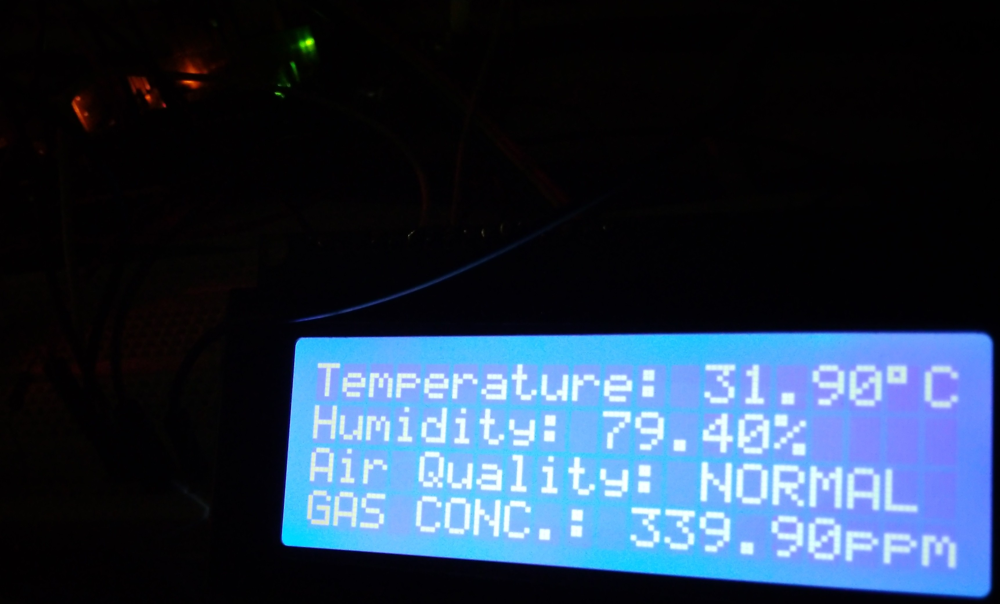

# arduino-enviro101
Arduino prototype for analysing the environment and displaying the relevant data on an LCD

  

This repository contains the relevant code and the _Fritzing_ circuit file for the project. Please note that the circuit is not 100% accurate since I was unable to find a part for MQ135 with the breaker board (which I used).

If you'd like to use the code please grab a [release](https://example.com/) file from here which contains only the sketch and the relevant libraries. You would need the libraries in the `lib` directory plus the [Adafruit Unified Sensor library](https://github.com/adafruit/Adafruit_Sensor). Everything else should work as expected.

The code itself is mostly plain C and quite lightweight (excluding the libraries of course) written rather haphazardly but should be very legible otherwise.

## Features:
* Accurately calculates and displays the humidity and temperature using the _DHT22_ sensor
* Inputs gas information from the MQ135 and attempts to interpret the air quality 
* Displays the above information on the 20x4 LCD display

## Wishlist:
* Route the data to an ESP8266 NodeMCU module and send it to a webserver
* Include a sleep mode so the assembly could run off batteries without power issues

## Legal:
This is free and unencumbered software released into the public domain.

Anyone is free to copy, modify, publish, use, compile, sell, or
distribute this software, either in source code form or as a compiled
binary, for any purpose, commercial or non-commercial, and by any
means. See the [LICENSE](LICENSE) for more information.

All the free and open-source dependencies in the `lib` directory (including any that might be added in the future) are under the copyright of their respective owners.
